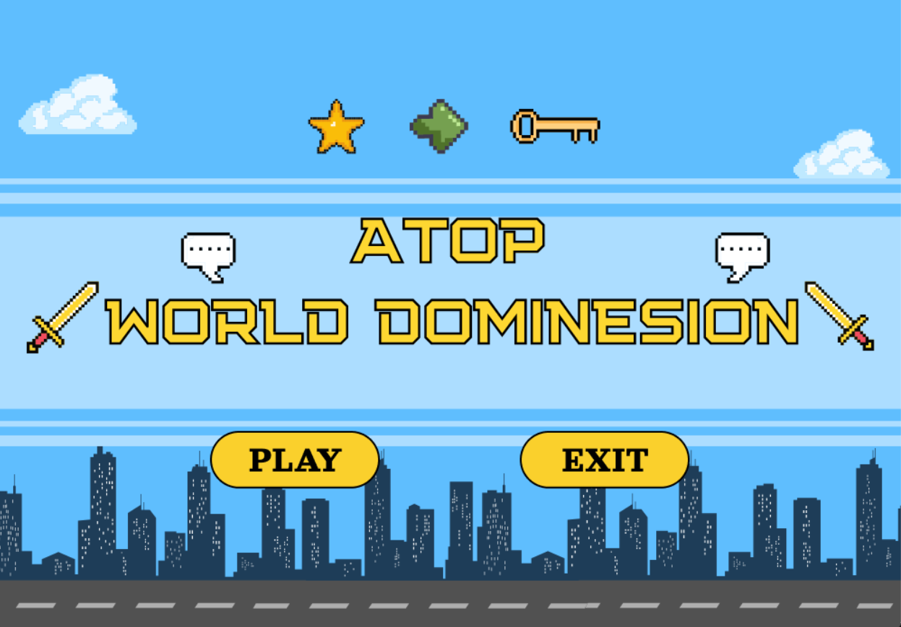
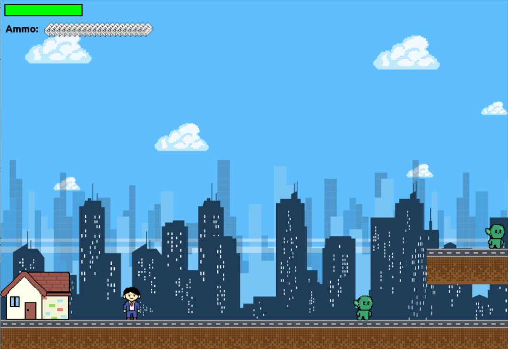

# 👽 Atop World Dominesion 👽


 Pada hari yang indah, bumi tiba tiba dihancurkan oleh makhluk luar angkasa. Kiki -- karyawan swasta di suatu perusahaan kecil menonton berita soal kedatangan makhluk tersebut kemudian berpikir tidak mungkin tempat kerja nya masih beroperasi. Tetapi kemudian telepon berdering disaat Kiki ingin tidur kembali. Ternyata telepon itu berasal dari bosnya. Bos menyuruh Kiki untuk datang ke tempat kerja di saat bumi perlahan mulai hancur... "YANG BENER AJE!" 

 Mampukah Kiki pergi berangkat kerja ke kantor tepat waktu? Tetapi keadaan bumi di luar rumah kecilnya terlalu kacau balau!

## Tampilan game
#### Level 1: Kiki vs Goblin


## 🖲 How To Play
#### Langkah 1: Pastikan Kamu Punya Beberapa Hal Ini

Pertama, pastikan kamu sudah menginstal beberapa hal berikut di komputermu:
1. **Python** (versi 3.6 atau yang lebih baru). Kamu bisa download dan instal dari [sini](https://www.python.org/downloads/).
2. **Git**. Alat ini berguna untuk mengunduh source code dari GitHub. Kamu bisa download dan instal dari [sini](https://git-scm.com/downloads).

#### Langkah 2: Clone Repository dari GitHub

Setelah semuanya siap, sekarang kita akan mengunduh source code game "AtopDW" dari GitHub. Buka terminal atau command prompt di komputermu, lalu ketik perintah berikut:

```bash
git clone https://github.com/sigawari/AtopDW-PBOGame.git
```

Perintah ini akan mendownload seluruh source code game ke komputermu.

#### Langkah 3: Masuk ke Direktori Game

Setelah proses clone selesai, masuklah ke direktori tempat source code game berada. Kamu bisa melakukan ini dengan mengetik perintah berikut di terminal atau command prompt:

```bash
cd AtopDW-PBOGame
```

#### Langkah 4: Menjalankan Game

Sekarang, saatnya untuk menjalankan game! Kamu hanya perlu menjalankan file `main.py`. Caranya, ketik perintah berikut di terminal:

```bash
python main.py
```

Jika semua langkah di atas sudah kamu ikuti dengan benar, game "AtopDW" seharusnya sekarang sudah bisa kamu mainkan. Selamat bersenang-senang!

#### Masalah yang Mungkin Muncul

Jika kamu menemui masalah atau error saat menjalankan game, jangan ragu untuk cek kembali langkah-langkah di atas. Pastikan semua dependensi terinstal dengan benar dan kamu menggunakan versi Python yang sesuai. Jika masih ada masalah, kamu bisa mencari solusi di [artikel ini](https://www.adventuresinmachinelearning.com/troubleshooting-pygame-common-errors-and-how-to-fix-them/).

Semoga berhasil dan selamat bermain!


## 🤖ADISI TEAM


| NIM | Nama | Role |
| :--------: | ------- | ------------------------- |
| 122140202 | [Dharma Rizki Geraldo](https://www.instagram.com/dharma_geraldo/) | Project Leader and Programming |
| 122140201 | [Ayu Jannati Ali Putri](https://www.instagram.com/ayujnnti/) | UML and Music Designer |
| 122140207 | [Intan Permata Sari](https://www.instagram.com/lntan_permata/) | Background Designs and Sound Assets |
| 122140210 | [Sakinah Aulia](https://www.instagram.com/skicha.a/) | Character Designs (Artist) and Story |
| 122140208 | [Sikah Nubuahtul Ilmi](https://www.instagram.com/sikahn_/) | Programming | 


## ⚙️Tech Requirements
#### 1. Sistem Operasi
- Windows 7 atau yang lebih baru
- MacOS X 10.10 atau yang lebih baru
- Distribusi Linux dengan versi kernel yang mendukung Python dan Pygame

#### 2. Python
- Python 3.6 atau yang lebih baru
  - Pastikan Python terinstal dan bisa diakses melalui command line atau terminal. Kamu bisa download Python dari [sini](https://www.python.org/downloads/).

#### 3. Pygame
- Pygame library untuk Python
  - Pygame bisa diinstal menggunakan pip dengan perintah berikut:
    ```bash
    pip install pygame
    ```

#### 4. Perangkat Keras
- Prosesor: Dual-core 1.6 GHz atau lebih cepat
- RAM: Minimum 2 GB (4 GB atau lebih disarankan)
- Grafis: Kartu grafis terintegrasi sudah cukup, namun kartu grafis dedicated lebih baik untuk performa yang lebih baik
- Penyimpanan: Setidaknya 200 MB ruang kosong untuk menginstal Python, Pygame, dan file game

#### 5. Dependencies Tambahan
- SDL (Simple DirectMedia Layer)
  - Pygame dibangun di atas SDL, jadi pastikan sistemmu mendukungnya. Biasanya, SDL otomatis terinstal saat kamu menginstal Pygame.
- OpenGL (opsional)
  - Untuk beberapa game yang memanfaatkan grafis 3D, dukungan OpenGL mungkin diperlukan.

#### 6. Tools dan Software Pendukung
- Text Editor atau IDE untuk menulis dan mengedit kode Python. Beberapa pilihan yang populer:
  - Visual Studio Code ([Download di sini](https://code.visualstudio.com/))
  - PyCharm ([Download di sini](https://www.jetbrains.com/pycharm/download/))
  - Sublime Text ([Download di sini](https://www.sublimetext.com/))
- Git (opsional)
  - Berguna untuk mengunduh project dari repositori seperti GitHub dan mengelola versi kode.
## 📚Acknowledgements

* [PyGame: A Primer on Game Programming in Python](https://realpython.com/pygame-a-primer/)
* [Mario Bross](https://itsourcecode.com/free-projects/python-projects/mario-game-in-python-with-source-code/)
* [How to write a Good readme](https://github.com/russs123/Shooter)


# UML


